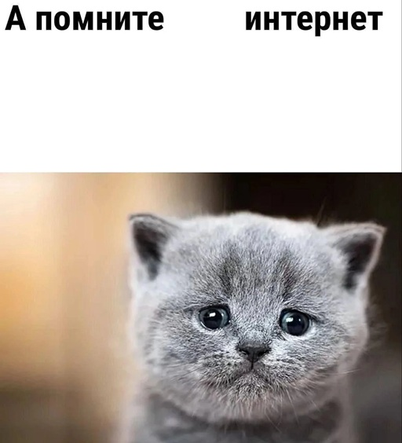

# «А помните    интернет»

 
Белый список для AmneziaVPN; составляется, по большому счёту, для себя и исходя из стадии «шизофрении» моего провайдера

## Что включено в список:
*Примечание: у AmneziaVPN странная логика обработки белого/чёрного списка, поэтому местами либо имеются повторы (с `www.`), либо только IP-адреса*

    
BookStack

- bookstackapp.com *(88.99.102.202)*

    
DeepL

- deepl.com *(104.18.36.122)*

    
DeviantArt

*Примечание: скорее всего, сайт сам по себе «умер», т.к. даже веб-архиватор ловит 403*

- deviantart.com *(108.156.22.88)*
- www.deviantart.com *(108.156.22.21)*
- 108.156.91.119

    
Discord

*Примечание: звонки не проверялись, не было надобности в них*

- discord.com *(162.159.128.233)*
- discord.gg *(162.159.135.234)*
- discord.media *(162.159.137.234)*
- discordapp.com *(162.159.129.233)*
- discordstatus.com *(65.9.46.92)*
- images-ext-1.discordapp.net *(162.159.134.232)* (у клиента нет regex, но он «смотрит» здесь IP-адрес, так что вложения грузятся независимо от домена)
- newassets.hcaptcha.com *(104.19.229.21)* (чтобы не ловить окно «Ошибка при получении награды»)

    
Fandom

*Примечание: на фанатских вики не грузятся только картинки, **полностью** проксировать сайт не надо*

- static.wikia.nocookie.net *(172.66.2.166)*

    
GoFile

- 94.139.32.3 (за доменом `gofile.io` в Амнезии закреплён неверный (?) IP)

    
JoyReactor

*Примечание: браузер может случайно выдать заглушку «Этот сайт не поддерживает HTTPS-соединение»; просто допишите букву `s` после `http`*

- joyreactor.cc *(51.68.155.228)*
- reactor.cc *(193.70.94.47)* (для вложений в постах)

    
Mobian

- mobian.org *(195.201.242.170)*

    
ParaType

- paratype.com *(5.161.35.137)*

    
Pixiv

- pixiv.net *(210.140.139.161)*
- pximg.net *(210.140.139.130)*
- 210.140.139.152
- 210.140.139.158
- www.pixiv.net *(104.18.42.239)*

    
Sideloader Modpack Download site

- sideload.betterrepack.com *(192.95.36.140)*

    
Spotify

*Примечание: добавлялось чисто ради эмбедов в Дискорде*

- spotify.com *(35.186.224.24)*

    
X/Twitter

*Примечание: с этим сайтом пришлось очень сильно помучиться...*

- x.com *(172.66.0.227)*
- twitter.com *(172.66.0.227)* (для редиректа со старых ссылок на `x.com`)
- twttr.com *(104.244.42.1)*
- t.co *(162.159.140.229)*
- pbs.twimg.com *(199.232.172.159)*
- принадлежат `abs.twimg.com`, но его добавление в явном виде «ломает» проксирование соцсети:
    - 104.18.37.127
    - 172.64.148.197
    - 172.64.150.129

## Что ещё нужно сделать:
- Накидать сайтов, которые блокируют соединения с российских IP-адресов со **своей** стороны
- Добавить адреса Arknights: Endfield, чтобы не переключаться между своим и бесплатным прокси (и не мучиться с пингом 999 мс)
    - Возможно, к таковым относится `hg-cdn.com`...
- Добавить **больше** сайтов, попавших в опалу из-за прессинга CDN CloudFlare *(aka «ловушка 16 КБ»)*
- Добавить **ещё больше** IP-адресов `abs.twimg.com`, чтобы картинки не переставали внезапно грузиться?..
